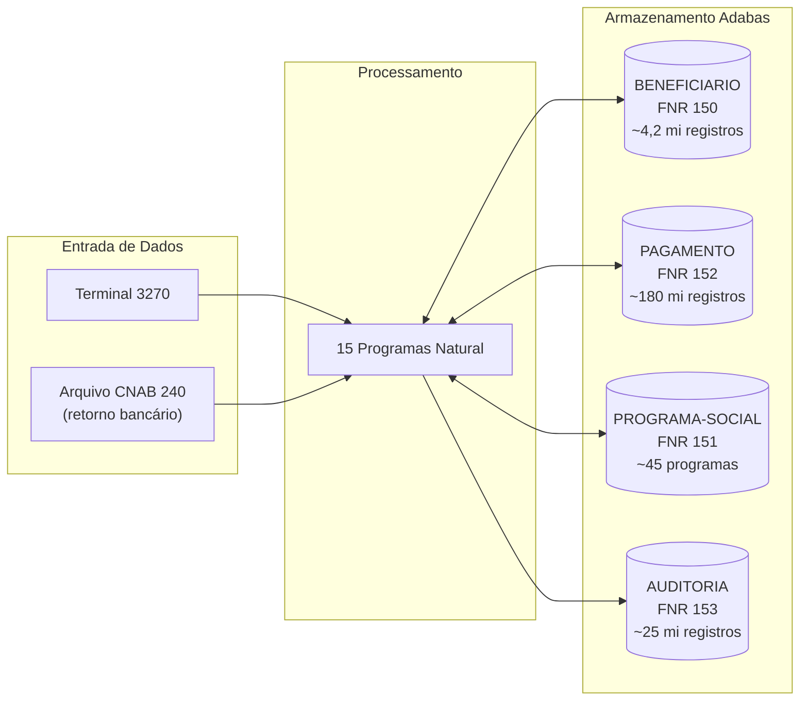

<!-- markdownlint-disable MD013 MD025 MD026 MD028 MD029 MD034 MD040 MD051 MD060 -->

# Mapa de Dependências — SIFAP Legado

  

> 🗺 **Você está aqui:** [Kit PT-BR](../README.md) → [Estágio 1](README.md) → **dependency-map**

> **Para quem é isto?** Este é um **artefato preenchido pelo time** durante o Estágio 1 (Arqueologia).
>
> **O que você terá ao final do estágio:**
>
> 1. Este documento totalmente preenchido com os dados reais do legado SIFAP
> 2. Rastreabilidade para `01-arqueologia/legado-sifap/` (programas `.NSN` e DDMs)
> 3. Base de evidência usada nas EARS do Estágio 2 (`source_legacy:`)
>
> 📘 **Guia passo a passo:** [`GUIDE.md`](GUIDE.md).

> Use diagramas Mermaid para mapear as dependências entre programas Natural e DDMs Adabas.
> O objetivo é visualizar "quem chama quem" e "quem lê/escreve o quê".

## Como descobrir dependências

- Use `grep` ou Copilot Chat para listar todas as ocorrências de `CALLNAT` nos 15 arquivos `.NSN`.
- Prompt útil: _"Liste todas as ocorrências de CALLNAT nestes arquivos e desenhe um diagrama Mermaid."_
- Para leitura/escrita em DDMs: procure por `READ`, `READ LOGICAL`, `STORE`, `UPDATE`, `DELETE`.

## Diagrama de Dependências entre Programas

> Substitua o exemplo abaixo pelo mapa real do seu time. **Meta:** cobrir todos os 15 programas, sem órfãos.

```mermaid
flowchart TD
    subgraph CADASTRO["Módulo Cadastro — Online 3270"]
        CADBENEF["CADBENEF.NSN\nCadastro Beneficiário"]
        CADDEPEND["CADDEPEND.NSN\nCadastro Dependentes"]
        CADPROG["CADPROG.NSN\nCadastro Programas"]
        VALDOCS["VALDOCS.NSN\nValidação Documentos"]
        VALBENEF["VALBENEF.NSN\nValidação Cadastral"]
        VALELEG["VALELEG.NSN\nValidação Elegibilidade"]
    end

    subgraph CALC["Módulo Cálculo"]
        CALCBENF["CALCBENF.NSN\nCálculo Benefício"]
        CALCDSCT["CALCDSCT.NSN\nCálculo Descontos"]
        CALCCORR["CALCCORR.NSN\nCorreção IPCA"]
    end

    subgraph BATCH["Módulo Batch — JES2 1º dia útil"]
        BATCHPGT["BATCHPGT.NSN\nGeração Pagamentos"]
        BATCHCON["BATCHCON.NSN\nConciliação CNAB 240"]
        BATCHREL["BATCHREL.NSN\nRelatórios Consolidados"]
    end

    subgraph CONSULTA["Módulo Consulta — Online"]
        CONSBENF["CONSBENF.NSN\nConsulta Beneficiário"]
        RELPGT["RELPGT.NSN\nRelatório Pagamentos"]
        RELAUDIT["RELAUDIT.NSN\nTrilha Auditoria"]
    end

    subgraph DDMs["DDMs Adabas"]
        BENEF[("BENEFICIARIO\nFNR 150")]
        PGTO[("PAGAMENTO\nFNR 152")]
        PROG[("PROGRAMA-SOCIAL\nFNR 151")]
        AUDIT[("AUDITORIA\nFNR 153")]
    end

    %% Cadastro -> DDMs
    CADBENEF -->|"PERFORM VALIDA-CPF"| VALDOCS
    CADBENEF -->|"PERFORM VALIDA"| VALBENEF
    CADBENEF -->|"STORE/UPDATE"| BENEF
    CADDEPEND -->|"UPDATE PE group"| BENEF
    CADPROG -->|"STORE"| PROG
    VALDOCS -->|"READ"| BENEF
    VALBENEF -->|"READ"| BENEF
    VALELEG -->|"READ"| BENEF
    VALELEG -->|"READ"| PROG

    %% Batch -> DDMs (BATCHPGT replica lógica de CALCBENF inline)
    BATCHPGT -->|"READ BY CPF"| BENEF
    BATCHPGT -->|"READ"| PROG
    BATCHPGT -->|"STORE"| PGTO
    BATCHPGT -->|"lógica inline\n(não CALLNAT)"| CALCBENF
    BATCHCON -->|"READ WORK FILE 1\n(CNAB 240)"| BATCHCON
    BATCHCON -->|"UPDATE"| PGTO
    BATCHCON -->|"STORE"| AUDIT
    BATCHREL -->|"READ BY COMPETENCIA"| PGTO
    BATCHREL -->|"READ"| BENEF

    %% Cálculo -> DDMs
    CALCBENF -->|"READ"| BENEF
    CALCBENF -->|"READ"| PROG
    CALCBENF -->|"STORE"| PGTO
    CALCDSCT -->|"READ"| PGTO
    CALCDSCT -->|"READ"| BENEF
    CALCCORR -->|"UPDATE"| PGTO

    %% Consulta -> DDMs
    CONSBENF -->|"READ BY CPF/NIS"| BENEF
    CONSBENF -->|"READ BY CPF-BENEF"| PGTO
    RELPGT -->|"READ BY COMPETENCIA"| PGTO
    RELPGT -->|"READ"| BENEF
    RELAUDIT -->|"READ BY DT-EVENTO"| AUDIT
```

## Diagrama de Fluxo de Dados (DDMs)

## Tabela de Dependências

| Programa | Chama (PERFORM/lógica inline) | Lê (READ) DDMs | Escreve (STORE/UPDATE) DDMs | Observações |
| ------------ | --------------- | -------------- | --------------------------- | ----------- |
| CADBENEF.NSN | PERFORM VALIDA-CPF, VALIDA-NOME | BENEFICIARIO | BENEFICIARIO | Ponto de entrada de cadastro; lida com operações I e A |
| CADDEPEND.NSN | — | BENEFICIARIO | BENEFICIARIO (PE group) | Atualiza grupo periódico de dependentes |
| CADPROG.NSN | PERFORM CONSULTA-PROG | PROGRAMA-SOCIAL | PROGRAMA-SOCIAL | Aplica FATOR-K=0.347215 antes de gravar VLR-BASE |
| VALBENEF.NSN | PERFORM VALIDA-CPF-COMPLETO | BENEFICIARIO | — | Validação apenas de leitura |
| VALDOCS.NSN | PERFORM VALIDA-CPF-DOC, VALIDA-RG, CHECK-DOC-ESPECIAL | BENEFICIARIO | — | Backdoor de 8 prefixos de CPF especiais |
| VALELEG.NSN | — | BENEFICIARIO, PROGRAMA-SOCIAL | — | COD-REGIAO=99 bypassa tudo |
| CALCBENF.NSN | PERFORM DET-FAIXA-RENDA, CALC-DESCONTOS | BENEFICIARIO, PROGRAMA-SOCIAL | PAGAMENTO | Lógica DUPLICADA em BATCHPGT.NSN inline |
| CALCDSCT.NSN | PERFORM CALC-CONTRIB-SOCIAL | PAGAMENTO, BENEFICIARIO | — | Descontos judiciais sem teto de 30% |
| CALCCORR.NSN | PERFORM CALC-INDICE-ACUM | PAGAMENTO | PAGAMENTO | Tabela IPCA parada em 2014 |
| BATCHPGT.NSN | Lógica de CALCBENF/CALCDSCT INLINE | BENEFICIARIO, PROGRAMA-SOCIAL | PAGAMENTO | Replica regras de cálculo sem CALLNAT — risco de divergência |
| BATCHCON.NSN | PERFORM GRAVA-AUDITORIA-DIVERG | PAGAMENTO | PAGAMENTO, AUDITORIA | Layout CNAB 240 Banco do Brasil hardcoded |
| BATCHREL.NSN | PERFORM IMPRIME-CABECALHO | PAGAMENTO, BENEFICIARIO | — | Usa arredondamento, divergindo de CALCBENF |
| CONSBENF.NSN | PERFORM MASCARA-CPF | BENEFICIARIO, PAGAMENTO | — | Bug conhecido na máscara de CPF documentado no código |
| RELPGT.NSN | PERFORM IMPRIME-REL | PAGAMENTO, BENEFICIARIO | — | Relatório analítico de pagamentos por competência |
| RELAUDIT.NSN | PERFORM IMPRIME-CAB-AUDIT | AUDITORIA | — | Filtra exclusões ('EX') silenciosamente |

## Dependências Circulares

Nenhuma dependência circular encontrada. Os programas Natural não usam CALLNAT entre si — a comunicação se dá exclusivamente via DDMs Adabas (acesso compartilhado ao banco de dados).

> **Nota crítica:** BATCHPGT **não chama** CALCBENF via CALLNAT — replica a lógica inline por performance. Isso é uma pseudo-dependência que pode ter divergido.

## Programas Órfãos

Nenhum programa é órfão — todos os 15 programas têm um papel identificado:

- **CADBENEF, CADDEPEND, CADPROG, VALBENEF, VALDOCS, VALELEG, CONSBENF** — invocados pelos operadores via terminal 3270
- **BATCHPGT, BATCHCON, BATCHREL** — invocados pelo scheduler JES2 no 1º dia útil
- **CALCBENF, CALCDSCT, CALCCORR** — chamados por operadores para cálculos pontuais (não chamados por outros programas via CALLNAT)
- **RELPGT, RELAUDIT** — invocados sob demanda por auditores e analistas

> **Atenção:** CALCBENF e CALCDSCT parecem ser pontos de entrada independentes mas sua lógica é replicada em BATCHPGT. Na migração, devem virar um único serviço Java chamado por todos.

---

### Continuar a leitura

<table width="100%">
<tr>
<td width="50%" valign="top" align="left">
<strong>← ANTERIOR</strong> 
<a href="business-rules-catalog.md"><strong>business-rules-catalog.md</strong></a> 
Catálogo de regras.
</td>
<td width="50%" valign="top" align="right">
<strong>PRÓXIMO →</strong> 
<a href="discovery-report.md"><strong>discovery-report.md</strong></a> 
Síntese final.
</td>
</tr>
</table>

↑ <a href="README.md">Voltar ao Kit PT-BR</a>

