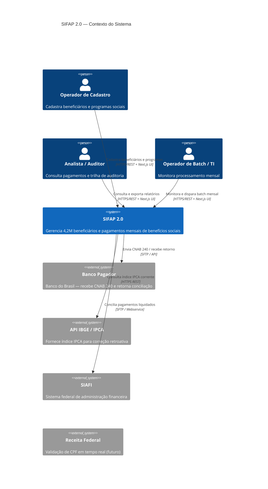
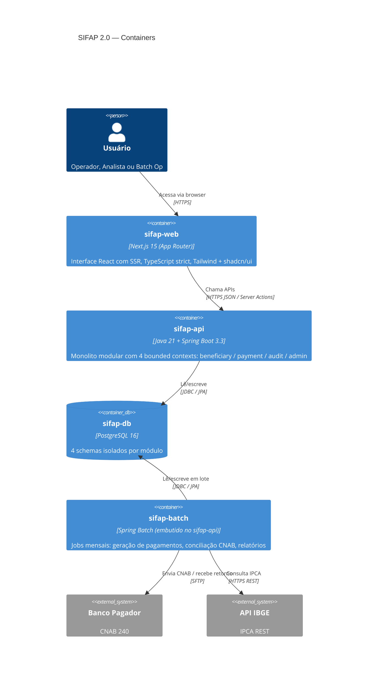
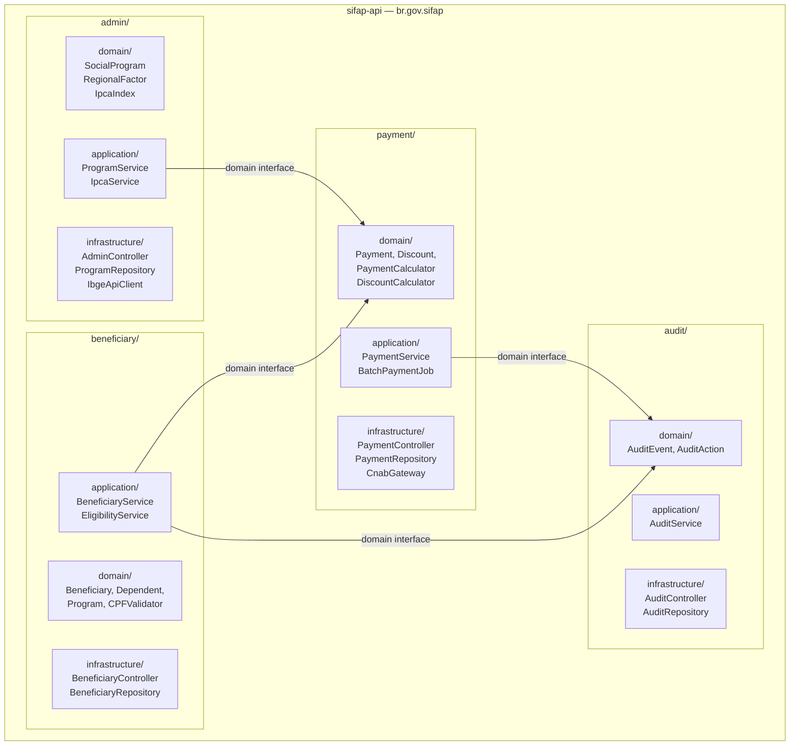

<!-- markdownlint-disable MD013 MD025 MD026 MD028 MD029 MD034 MD040 MD051 MD060 -->

# SPECIFICATION — SIFAP 2.0 · grupo-azul-1

  

## Metadados

- **Versão da spec:** 0.1.0 (Estágio 2 — 27/05/2026)
- **Time:** grupo-azul-1
- **Aprovado pelo Product Owner:** ☐ (pendente sign-off Passagem #2)
- **Origem dos requisitos:** `01-arqueologia/business-rules-catalog.md` (BR-001 a BR-021)
- **Total de REQ-IDs:** 16
- **REQ-IDs com `source_legacy`:** 14 · **`[GREENFIELD]`:** 2

---

## Arquitetura C4 — Visão do Sistema

### C4 L1 — Contexto



### C4 L2 — Containers (Modular Monolith)



### C4 L3 — Bounded Contexts (dentro de sifap-api)



> **Regra de fronteira (verificada pelo ArchUnit):** nenhum módulo importa classes de `infrastructure/` de outro módulo. Toda comunicação cross-módulo passa por interfaces declaradas em `domain/`.

---

## Módulo: `beneficiary`

### REQ-BEN-001 · Validação de CPF por MOD-11

```yaml
REQ-BEN-001:
  pattern: ubiquitous
  text: "O SIFAP deve validar o CPF de todo beneficiário cadastrado usando o
         algoritmo MOD-11, rejeitando CPFs com todos os dígitos iguais e
         retornando erro HTTP 422 com código BEN_INVALID_CPF para documentos inválidos."
  source_legacy: 01-arqueologia/legado-sifap/natural-programs/VALDOCS.NSN#L60-L120
  business_rule: BR-016
  acceptance:
    - "CPF '000.000.000-00' → HTTP 422 BEN_INVALID_CPF (todos dígitos iguais)."
    - "CPF '123.456.789-09' (MOD-11 válido) → aceito."
    - "CPF '123.456.789-00' (MOD-11 inválido) → HTTP 422 BEN_INVALID_CPF."
    - "CPFs com prefixo 000, 001, 002, 010, 011, 099, 100, 999 devem ser validados normalmente (backdoor de testes REMOVIDO)."
  priority: P0
  risk: ALTO
  notes: "Remover o backdoor dos 8 prefixos especiais (MYS-007). Ambiente de teste usa perfil Spring com mock."
```

### REQ-BEN-002 · Elegibilidade por tipo de programa social

```yaml
REQ-BEN-002:
  pattern: event-driven
  text: "Quando um beneficiário é vinculado a um programa social, o SIFAP deve
         verificar elegibilidade conforme o tipo do programa:
         Assistencial (A) exige renda ≤ R$600 e ao menos 1 dependente;
         Previdenciário (P) exige idade ≥ 60 anos;
         Trabalho (T) exige 16 ≤ idade ≤ 65 anos."
  source_legacy: 01-arqueologia/legado-sifap/natural-programs/VALELEG.NSN#L140-L175
  business_rule: BR-017
  acceptance:
    - "Beneficiário tipo A com renda R$500 e 2 dependentes → elegível."
    - "Beneficiário tipo A com renda R$700 → HTTP 422 BEN_NOT_ELIGIBLE (renda excede limite)."
    - "Beneficiário tipo A com renda R$500 e 0 dependentes → HTTP 422 BEN_NOT_ELIGIBLE."
    - "Beneficiário tipo P com idade 61 → elegível."
    - "Beneficiário tipo T com idade 70 → HTTP 422 BEN_NOT_ELIGIBLE."
  priority: P0
  risk: CRÍTICO
```

### REQ-BEN-003 · Suspensão automática para maiores de 75 anos

```yaml
REQ-BEN-003:
  pattern: event-driven
  text: "Quando um beneficiário com idade superior a 75 anos é cadastrado ou
         tem a data de nascimento atualizada, o SIFAP deve definir o status
         como SUSPENDED automaticamente E registrar um evento de auditoria
         com motivo 'AGE_LIMIT_EXCEEDED'."
  source_legacy: 01-arqueologia/legado-sifap/natural-programs/CADBENEF.NSN#L165-L170
  business_rule: BR-011
  acceptance:
    - "Cadastro de beneficiário com 76 anos → status='SUSPENDED', auditoria gravada com motivo AGE_LIMIT_EXCEEDED."
    - "Cadastro de beneficiário com 75 anos → status='ACTIVE' (limite exclusivo)."
    - "Operador recebe aviso HTTP 201 com campo 'warnings: [AGE_LIMIT_EXCEEDED]' no body."
  priority: P1
  risk: MÉDIO
  notes: "No legado era silencioso (MYS-002). Na migração, tornar explícito com aviso ao operador."
```

### REQ-BEN-004 · Limite de 5 dependentes por família

```yaml
REQ-BEN-004:
  pattern: unwanted
  text: "O SIFAP não deve permitir o cadastro de mais de 5 dependentes por
         beneficiário, retornando HTTP 422 com código BEN_MAX_DEPENDENTS_EXCEEDED."
  source_legacy: 01-arqueologia/legado-sifap/natural-programs/CADDEPEND.NSN#L55
  business_rule: BR-012
  acceptance:
    - "Beneficiário com 4 dependentes adiciona 1 → total 5, aceito."
    - "Beneficiário com 5 dependentes tenta adicionar 1 → HTTP 422 BEN_MAX_DEPENDENTS_EXCEEDED."
    - "Limite configurável por programa social via REQ-ADM-001 (campo max_dependents em SocialProgram)."
  priority: P1
  risk: MÉDIO
  notes: "Legado tem conflito: código=5, DDM=10, doc2012=3. Adotamos 5 como regra real. DDM PostgreSQL suporta array sem limite físico."
```

---

## Módulo: `payment`

### REQ-PAY-001 · Fórmula central de cálculo do benefício

```yaml
REQ-PAY-001:
  pattern: ubiquitous
  text: "O SIFAP deve calcular o valor bruto de cada pagamento aplicando a fórmula:
         BRUTO = BASE × F_regional × F_familiar × F_renda × F_idade × (1 + F_reajuste),
         truncando o resultado em 2 casas decimais (não arredondando)."
  source_legacy: 01-arqueologia/legado-sifap/natural-programs/CALCBENF.NSN#L215-L235
  business_rule: BR-001, BR-010
  acceptance:
    - "BASE=1000, F_reg=1.20, F_fam=1.10, F_rnd=0.85, F_idade=1.00, F_reaj=0.05 → BRUTO=1319.98 (truncado, não 1319.99)."
    - "Todos os 5 fatores devem estar presentes; ausência de qualquer um → HTTP 500 com log de erro."
    - "Resultado nunca é arredondado: 1319.999 → 1319.99."
  priority: P0
  risk: CRÍTICO
  notes: "Fórmula estava duplicada entre CALCBENF e BATCHPGT (MYS-009). Na migração, existe UMA ÚNICA implementação em PaymentCalculator.java chamada por ambos os fluxos."
```

### REQ-PAY-002 · Fatores regionais configuráveis por UF

```yaml
REQ-PAY-002:
  pattern: ubiquitous
  text: "O SIFAP deve aplicar um fator regional por UF de residência do
         beneficiário, lido da tabela 'regional_factors' do banco de dados
         (não hardcoded), permitindo atualização sem redeploy."
  source_legacy: 01-arqueologia/legado-sifap/natural-programs/CALCBENF.NSN#L90-L118
  business_rule: BR-002
  acceptance:
    - "UF='MA' → fator 1.40 (valor inicial de migração, idêntico ao legado)."
    - "UF='RS' → fator 1.03 (valor inicial de migração)."
    - "Administrador atualiza fator via API PUT /api/v1/admin/regional-factors/{uf} → cálculos seguintes usam novo valor."
    - "UF sem registro na tabela → HTTP 422 PAY_UNKNOWN_REGION."
  priority: P0
  risk: CRÍTICO
  notes: "GREENFIELD: tabela configurável em banco substitui array hardcoded. Valores iniciais migrados do CALCBENF.NSN#L90-L118."
```

### REQ-PAY-003 · Teto de 30% para descontos não judiciais

```yaml
REQ-PAY-003:
  pattern: unwanted
  text: "O SIFAP não deve permitir que o somatório de descontos com tipo
         diferente de JUDICIAL e PENSION exceda 30% do valor bruto do pagamento.
         O excesso deve ser truncado ao limite, nunca retornado como erro."
  source_legacy: 01-arqueologia/legado-sifap/natural-programs/CALCDSCT.NSN#L105-L125
  business_rule: BR-009
  acceptance:
    - "Bruto=1000, desconto TAX=400 → desconto aplicado=300.00 (teto 30%)."
    - "Bruto=1000, desconto JUDICIAL=800 → desconto aplicado=800.00 (sem teto)."
    - "Bruto=1000, TAX=200 + JUDICIAL=400 → total=600, aceito (600 > 300 mas judicial não conta no teto)."
    - "VLR-LIQUIDO nunca pode ser negativo; se descontos judiciais zerarem o valor, VLR-LIQUIDO=0.00."
  priority: P0
  risk: CRÍTICO
```

### REQ-PAY-004 · Benefício do 13º salário em dezembro

```yaml
REQ-PAY-004:
  pattern: event-driven
  text: "Quando o ciclo de pagamento ocorre no mês de dezembro (competência AAAA12),
         o SIFAP deve gerar um pagamento adicional do tipo THIRTEENTH com a fórmula
         simplificada: BRUTO_13 = BASE × F_regional × F_idade × (1 + F_reajuste),
         pro-rateado pelos meses de vigência do beneficiário no ano corrente."
  source_legacy: 01-arqueologia/legado-sifap/natural-programs/CALCBENF.NSN#L237-L265
  business_rule: BR-006, BR-007
  acceptance:
    - "Beneficiário tipo A com 12 meses ativos em dezembro → BRUTO_13 = BASE × F_reg × F_idade × (1+F_reaj)."
    - "Beneficiário com 6 meses ativos (ingressou em julho) → BRUTO_13 = valor_cheio × (6/12), truncado."
    - "Abono de 15% aplicado somente para programas tipo A sobre o BRUTO_13."
    - "Programas tipo P e T → sem abono natalino de 15%."
  priority: P0
  risk: CRÍTICO
  notes: "Pro-rata estava comentado no legado mas nunca implementado (MYS-010). Implementar na migração."
```

### REQ-PAY-005 · Batch mensal idempotente e ordenado por CPF

```yaml
REQ-PAY-005:
  pattern: event-driven
  text: "Quando o job de geração de pagamentos mensal é executado para uma
         competência, o SIFAP deve processar os beneficiários ativos em ordem
         crescente de CPF e ignorar silenciosamente qualquer beneficiário que
         já tenha registro de pagamento para aquela competência."
  source_legacy: 01-arqueologia/legado-sifap/natural-programs/BATCHPGT.NSN#L180-L215
  business_rule: BR-018, BR-019
  acceptance:
    - "Job executado duas vezes para mesma competência → segunda execução gera 0 novos pagamentos."
    - "100 beneficiários ativos → arquivo de saída contém 100 linhas em ordem de CPF crescente."
    - "Beneficiário com pagamento existente → pulado, log INFO 'SKIPPED: already_paid'."
    - "Ordem CPF é garantida mesmo que banco retorne em outra ordem (ORDER BY cpf ASC na query)."
  priority: P0
  risk: CRÍTICO
  notes: "A ordenação por CPF é contrato com sistemas downstream do governo federal. Não alterar sem análise de impacto."
```

### REQ-PAY-006 · Conciliação CNAB 240 com tolerância de R$0,01

```yaml
REQ-PAY-006:
  pattern: event-driven
  text: "Quando o arquivo de retorno bancário CNAB 240 é processado, o SIFAP
         deve aceitar divergências de até R$0,01 entre o valor enviado e o
         valor retornado pelo banco, marcando o pagamento como RECONCILED.
         Divergências acima de R$0,01 devem gerar evento de auditoria com
         ação DIVERGENCE e manter o pagamento como PENDING_RECONCILIATION."
  source_legacy: 01-arqueologia/legado-sifap/natural-programs/BATCHCON.NSN#L120-L175
  business_rule: BR-020
  acceptance:
    - "Enviado R$1000.00, retornado R$1000.00 → RECONCILED."
    - "Enviado R$1000.00, retornado R$999.99 (diff=R$0.01) → RECONCILED (dentro da tolerância)."
    - "Enviado R$1000.00, retornado R$999.98 (diff=R$0.02) → PENDING_RECONCILIATION + evento auditoria DIVERGENCE."
    - "Layout CNAB 240 suportado: Banco do Brasil (código 001). Outros bancos configuráveis via plugin."
  priority: P1
  risk: MÉDIO
  notes: "Layout hardcoded para BB no legado (EGG-003). Nova versão usa padrão FEBRABAN com plugin por banco."
```

### REQ-PAY-007 · Contribuição social compulsória por faixas de renda

```yaml
REQ-PAY-007:
  pattern: ubiquitous
  text: "O SIFAP deve aplicar contribuição social compulsória sobre o valor bruto
         do pagamento conforme a faixa: até R$500 → 3%; até R$1.000 → 5%;
         até R$2.000 → 7%; acima de R$2.000 → 9%. A alíquota incide sobre o
         valor total bruto (não progressiva)."
  source_legacy: 01-arqueologia/legado-sifap/natural-programs/CALCDSCT.NSN#L40-L80
  business_rule: BR-008
  acceptance:
    - "Bruto=400 → contribuição=12.00 (3% de 400)."
    - "Bruto=800 → contribuição=40.00 (5% de 800, alíquota sobre o total)."
    - "Bruto=1500 → contribuição=105.00 (7% de 1500)."
    - "Bruto=3000 → contribuição=270.00 (9% de 3000)."
    - "Faixas configuráveis via tabela 'contribution_bands' sem redeploy (REQ-ADM-001)."
  priority: P0
  risk: CRÍTICO
```

---

## Módulo: `audit`

### REQ-AUD-001 · Trilha de auditoria completa incluindo exclusões

```yaml
REQ-AUD-001:
  pattern: ubiquitous
  text: "O SIFAP deve registrar um evento de auditoria para TODA alteração
         de estado em beneficiário ou pagamento, incluindo operações de
         exclusão (DELETION), sem filtros ou supressões por tipo de ação."
  source_legacy: 01-arqueologia/legado-sifap/natural-programs/RELAUDIT.NSN#L90-L95
  business_rule: BR-015
  acceptance:
    - "Exclusão de beneficiário → evento auditoria com ação='DELETION' gravado."
    - "Consulta ao relatório de auditoria com filtro de datas → exclusões aparecem no resultado."
    - "Não existe nenhum filtro automático por tipo de ação no código."
    - "Conformidade IN-TCU 63/2010: todos os 6 tipos de ação (IN, AL, EX, CO, CN, DV) visíveis."
  priority: P0
  risk: CRÍTICO
  notes: "CORREÇÃO de BR-015: o legado filtrava silenciosamente eventos EX. Na migração isso é corrigido obrigatoriamente."
```

### REQ-AUD-002 · Imutabilidade dos registros de auditoria

```yaml
REQ-AUD-002:
  pattern: unwanted
  text: "O SIFAP não deve permitir atualização ou exclusão de registros da
         tabela de auditoria por nenhum perfil de usuário, incluindo ADMIN."
  source_legacy: "[GREENFIELD] Exigência IN-TCU 63/2010 — trilha imutável. Legado não tinha controle; risco identificado no MYS-008."
  acceptance:
    - "DELETE em audit_events via API → HTTP 405 Method Not Allowed."
    - "UPDATE em audit_events via API → HTTP 405 Method Not Allowed."
    - "Tabela 'audit_events' no PostgreSQL: sem UPDATE/DELETE grants para o usuário da aplicação."
    - "Apenas INSERT é permitido programaticamente."
  priority: P0
  risk: CRÍTICO
```

---

## Módulo: `admin`

### REQ-ADM-001 · Cadastro de programas sociais sem FATOR-K implícito

```yaml
REQ-ADM-001:
  pattern: ubiquitous
  text: "O SIFAP deve armazenar o valor base (base_value) de um programa social
         exatamente como informado pelo administrador, sem aplicar nenhum fator
         multiplicador implícito. O fator de reajuste (reajuste_factor) deve
         ser armazenado separadamente e aplicado em tempo de cálculo."
  source_legacy: 01-arqueologia/legado-sifap/natural-programs/CADPROG.NSN#L105-L115
  business_rule: BR-013
  acceptance:
    - "Administrador informa base_value=1000, reajuste_factor=0.05 → gravado como {base_value:1000, reajuste_factor:0.05}."
    - "GET /api/v1/admin/programs/{id} retorna base_value=1000 (não o valor com FATOR-K aplicado)."
    - "FATOR-K=0.347215 não existe no código — pendente esclarecimento com SENARC antes do go-live."
  priority: P0
  risk: CRÍTICO
  notes: "MYS-001: FATOR-K=0.347215 não documentado. AÇÃO BLOQUEANTE: consultar SENARC antes de migrar dados de PROGRAMA-SOCIAL."
```

### REQ-ADM-002 · Correção retroativa via API IBGE (substituição da tabela hardcoded)

```yaml
REQ-ADM-002:
  pattern: event-driven
  text: "Quando uma correção retroativa por IPCA é solicitada, o SIFAP deve
         obter o índice acumulado do período a partir da API pública do IBGE
         (https://servicodados.ibge.gov.br/api/v3/agregados/315/...) e
         aplicar sobre o valor bruto, idempotentemente."
  source_legacy: 01-arqueologia/legado-sifap/natural-programs/CALCCORR.NSN#L80-L140
  business_rule: BR-021
  acceptance:
    - "Correção para competência 2023-01 → SIFAP chama API IBGE e obtém índice real (não tabela hardcoded)."
    - "Pagamento com ind_corrigido=true → ignorado pela correção (idempotência)."
    - "Falha na API IBGE → operação falha com HTTP 503 e mensagem 'IBGE_API_UNAVAILABLE'; não aplica índice=1.0 silenciosamente."
    - "Tabela hardcoded CALCCORR removida — não migrada."
  priority: P1
  risk: ALTO
  notes: "GREENFIELD: integração com API IBGE substitui tabela parada em 2014. Implementar com circuit breaker."
```

### REQ-ADM-003 · Faixas de elegibilidade e descontos configuráveis

```yaml
REQ-ADM-003:
  pattern: ubiquitous
  text: "O SIFAP deve ler as faixas de renda para elegibilidade (REQ-BEN-002),
         os fatores de contribuição social (REQ-PAY-007) e os fatores de
         idade (REQ-PAY-001) de tabelas configuráveis no banco de dados,
         permitindo atualização por administrador sem redeploy."
  source_legacy: 01-arqueologia/legado-sifap/natural-programs/CALCBENF.NSN#L120-L215
  business_rule: BR-004, BR-005, BR-008
  acceptance:
    - "Administrador atualiza faixa de renda via PUT /api/v1/admin/income-bands → novos cadastros usam nova faixa."
    - "Cache das tabelas expirado a cada 15 minutos (não requer redeploy)."
    - "Valores iniciais carregados via Flyway migration com dados extraídos do CALCBENF.NSN."
  priority: P1
  risk: ALTO
  notes: "Faixas de 2013 nunca foram reajustadas no legado. Valores iniciais migrados; correção é responsabilidade da SENARC."
```

---

## Resumo dos REQ-IDs

| REQ-ID | Módulo | Padrão EARS | Prioridade | Risco | source_legacy |
|---|---|---|---|---|---|
| REQ-BEN-001 | beneficiary | ubiquitous | P0 | ALTO | VALDOCS.NSN#L60 |
| REQ-BEN-002 | beneficiary | event-driven | P0 | CRÍTICO | VALELEG.NSN#L140 |
| REQ-BEN-003 | beneficiary | event-driven | P1 | MÉDIO | CADBENEF.NSN#L165 |
| REQ-BEN-004 | beneficiary | unwanted | P1 | MÉDIO | CADDEPEND.NSN#L55 |
| REQ-PAY-001 | payment | ubiquitous | P0 | CRÍTICO | CALCBENF.NSN#L215 |
| REQ-PAY-002 | payment | ubiquitous | P0 | CRÍTICO | CALCBENF.NSN#L90 |
| REQ-PAY-003 | payment | unwanted | P0 | CRÍTICO | CALCDSCT.NSN#L105 |
| REQ-PAY-004 | payment | event-driven | P0 | CRÍTICO | CALCBENF.NSN#L237 |
| REQ-PAY-005 | payment | event-driven | P0 | CRÍTICO | BATCHPGT.NSN#L180 |
| REQ-PAY-006 | payment | event-driven | P1 | MÉDIO | BATCHCON.NSN#L120 |
| REQ-PAY-007 | payment | ubiquitous | P0 | CRÍTICO | CALCDSCT.NSN#L40 |
| REQ-AUD-001 | audit | ubiquitous | P0 | CRÍTICO | RELAUDIT.NSN#L90 |
| REQ-AUD-002 | audit | unwanted | P0 | CRÍTICO | [GREENFIELD] |
| REQ-ADM-001 | admin | ubiquitous | P0 | CRÍTICO | CADPROG.NSN#L105 |
| REQ-ADM-002 | admin | event-driven | P1 | ALTO | CALCCORR.NSN#L80 |
| REQ-ADM-003 | admin | ubiquitous | P1 | ALTO | CALCBENF.NSN#L120 |

**Total P0:** 10 · **Total P1:** 6 · **CRÍTICO:** 9 · **com `source_legacy`:** 14 · **`[GREENFIELD]`:** 2

---

## Definição de Pronto deste documento

- [x] ≥ 12 REQ-IDs com padrão EARS identificado
- [x] 100% dos REQ-IDs com `source_legacy:` ou `[GREENFIELD]` justificado
- [x] Diagramas C4 L1, L2 e L3 (Mermaid)
- [ ] ADRs principais: ver `ADR-001.md`, `ADR-002.md`, `ADR-003.md` nesta pasta
- [ ] Escopo assinado pelo Product Owner (Passagem #2)
